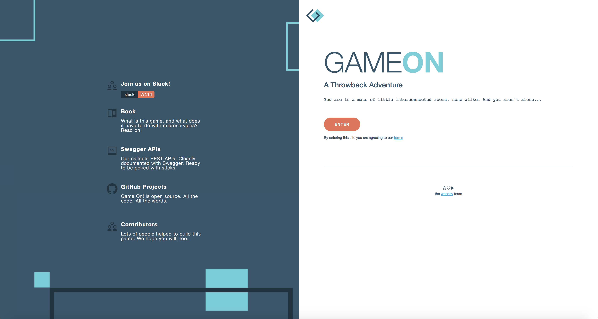
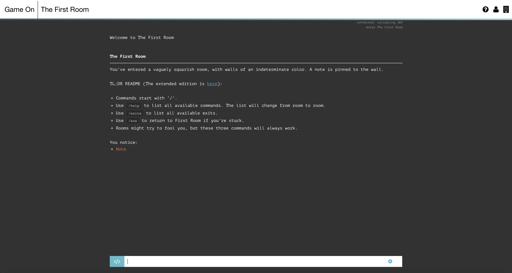

# kubernetes-container-service-gameon-java-microservice
The project is composed of multiple **microservices**. The app is the [GameOn! text adventure](https://developer.ibm.com/tv/gameon-text-adventure/), a game that uses **text** as input from a player. The project is deployed on the **Bluemix Kubernetes Container Service** and was based on the local development process of the GameOn! text adventure. The application shows what is a microservice architecture. There are several microservices used in this app ranging from **couchdb, redis, to frontend tier services**. Everything would be hosted in Bluemix Kubernetes Container Service where you can access your own GameOn app from anywhere.

## Prerequisite

Create a Kubernetes cluster with IBM Bluemix Container Service.

If you have not setup the Kubernetes cluster, please follow the [Creating a Kubernetes cluster](https://github.com/IBM/container-journey-template) tutorial.

## Steps
1. [Modify the yaml files](#1-modify-the-yaml-files)
2. [Create Volumes in your Cluster](#2-create-volumes-in-your-cluster)
3. [Create the Platform Services](#3-create-the-platform-services)
4. [Create the Core Services](#4-create-the-core-services)
5. [Explore your GameOn App](#5-explore-your-gameon-app)

A. [Adding Social Logins](#a-adding-social-logins)


# 1. Modify the yaml files
First, you'll need to update the yaml files for the **core services** and **setup.yaml**.
You will need to get the Public IP address of your cluster.
```bash
$ kubectl get nodes
NAME             STATUS    AGE
169.xx.xxx.xxx   Ready     13d
```
Take note of the IP address. Go to the **core** folder and change the following values on the environment variables of the container **on every file** to the IP address you have. Maintain the port number.
> Example:
> ...
> value : https://169.47.241.yyy:30443/players/v1/accounts **TO ->** value : https://169.xx.xxx.xxx:30443/players/v1/accounts
> ...


```yaml
Core yaml files should look like this. Change the following env variables
    spec:
      containers:
      - image: gameontext/gameon-*
        name: *
        env:
        ...
          - name: FRONT_END_PLAYER_URL
            value : https://169.47.241.137:30443/players/v1/accounts
          - name: FRONT_END_SUCCESS_CALLBACK
            value : https://169.47.241.137:30443/#/login/callback
          - name: FRONT_END_FAIL_CALLBACK
            value : https://169.47.241.137:30443/#/game
          - name: FRONT_END_AUTH_URL
            value : https://169.47.241.137:30443/auth
        ...
          - name: PROXY_DOCKER_HOST
            value : '169.47.241.137'
        ...
```
```yaml
setup.yaml
...
spec:
  restartPolicy: Never
  containers:
  - name: setup
    image: anthonyamanse/keystore
    env:
      - name: IP
        value: 169.47.241.137
    ...
```
# 2. Create Volumes in your Cluster
You would need to create a volume for your cluster. You can use the provided yaml file. The volume will also be used by the core services. This would contain some required keystores and server configurations.
```bash
$ kubectl create -f local-volumes.yaml
persistent volumes "local-volume-1" created
persistent volumes "keystore-claim" created
```

You can now create the required keystores using the **setup.yaml** file. This will create a Pod and create the keystores. Once it is done, the Pod will terminate. You may delete the pod after.
```bash
$ kubectl create -f setup.yaml
```
If you want to confirm that the Pod has successfully imported the keystores, you can view the Pod's logs.
```bash
$ kubectl logs setup
Checking for keytool...
Checking for openssl...
Generating key stores using <Public-IP-of-your-cluster>:30443
Certificate stored in file <keystore/gameonca.crt>
Certificate was added to keystore
Certificate reply was installed in keystore
Certificate stored in file <keystore/app.pem>
MAC verified OK
Certificate was added to keystore
Entry for alias <*> successfully imported.
...
Entry for alias <**> successfully imported.
Import command completed:  104 entries successfully imported, 0 entries failed or cancelled
```

# 3. Create the Platform Services
You can now create the Platform services and deployments of the app. You can use the script provided to create the services and deployments in one command or, alternatively, you can use **kubectl create -f** with every yaml file in the platform directory.
```bash
$ ./platform-services.sh
OR alternatively
$ kubectl create -f platform/controller.yaml
$ kubectl create -f platform/<file-name>.yaml
...
$ kubectl create -f platform/registry.yaml
```
> Note: It can take around 1-2 minutes for the Pods to setup completely.

# 4. Create the Core Services
Finally, you can create the Core services and deployments of the app. Like creating the platform services, you can use the script provided or use **kubectl create -f** with every yaml file in the core directory.
```bash
$ ./core-services.sh
OR alternatively
$ kubectl create -f core/auth.yaml
$ kubectl create -f core/<file-name>.yaml
...
$ kubectl create -f core/webapp.yaml
```
To verify if the core services has finished setting up, you would need to check the logs of the Pod of the proxy. You can get the Pod name of the proxy using **kubectl get pods**
```bash
kubectl logs proxy-***-**
```
You should look for the map, auth, and room servers. Confirm if they are UP.
```bash
[WARNING] 094/205214 (11) : Server room/room1 is UP, reason: Layer7 check passed ...
[WARNING] 094/205445 (11) : Server auth/auth1 is UP, reason: Layer7 check passed ...
[WARNING] 094/205531 (11) : Server map/map1 is UP, reason: Layer7 check passed ...

```
# 5. Explore your GameOn App

Now that you have successfully deployed your own app in the Bluemix Kubernetes Container Service, you can access it via its IP address and assigned Port.
> https://169.xxx.xxx.xxx:30XXX/

* You will see the homepage of your app on that address.

* Click on Enter to log in as Anonymous User(You will need to setup your own Social Login API keys)

* The app will prompt you to enter your desired **Username** and **Favorite Color**

* **Congratulations! You now have your own GameOn app running on Bluemix! You may now wish to explore on creating new rooms and adding social logins.**

# A. Adding Social Logins
You may want to add social logins so you and your friends can explore the rooms together.
To add social logins you would need to have developer accounts on the social app you want to use.
## Github
You can register your application in this link: [New OAuth Application](https://github.com/settings/applications/new)

For the Homepage URL, you will need to put the IP address of your cluster and the port 30443.
> https://169.xxx.xxx.xxx:30443/#/

For the Authorization callback URL, you will need to put the IP address and the port 30443 and point to the auth service of the app.
> https://169.xxx.xxx.xxx:30949/auth/GitHubCallback

You can edit that in the GitHub later if you made a new cluster.
Now, take note of the **Client ID** and **Client Secret** of the app.
You will need to add this in the environment variables on the yaml files of your **Core services**
```yaml
...
- name: GITHUB_APP_ID
  value : '<yourGitHubClientId>'
- name: GITHUB_APP_SECRET
  value : '<yourGitHubClientSecret>'
...
```
> The application uses the keys(name) **GITHUB_APP_ID** and **GITHUB_APP_SECRET** and must exactly match this in yaml files.

## Twitter

You can register your application with your Twitter account in this link: [Create new app](https://apps.twitter.com/app/new)


For the name field, you can put the name you want for your app.
For the Homepage URL, you will need to put the IP address of your cluster and the port 30443.
> https://169.xxx.xxx.xxx:30443/#/

For the Authorization callback URL, you will need to put the IP address and the port 30443 and point to the auth service of the app.
> https://169.xxx.xxx.xxx:30949/auth/TwitterAuth

Go to the Keys and Access Tokens section of the twitter application you just registered and take note of the **Consumer Key** and **Consumer Secret** of the app.
You will need to add this in the environment variables on the yaml files of your **Core services**
```yaml
...
- name: TWITTER_CONSUMER_KEY
  value : '<yourGitHubClientId>'
- name: TWITTER_CONSUMER_SECRET
  value : '<yourGitHubClientSecret>'
...
```
> The application uses the keys(name) **TWITTER_CONSUMER_KEY** and **TWITTER_CONSUMER_SECRET** and must exactly match these in the core yaml files.
